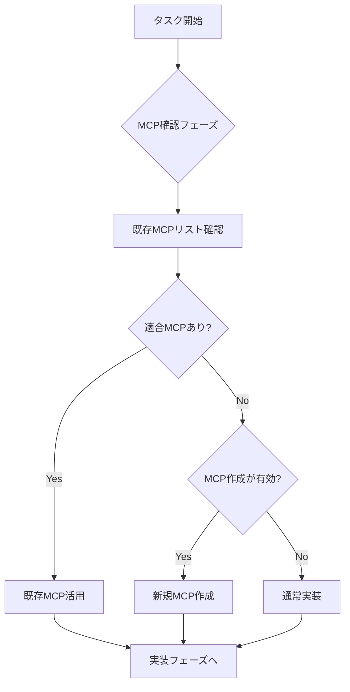

# MCP Integration Protocol - MCP First Approach

**Version**: 1.0.0
**Project**: Miyabi Lark OS
**Date**: 2025-10-29
**Status**: ✅ Production Ready

---

## 概要

全てのタスク実行前に、**MCPサーバーの活用可能性を優先的に検討する**ための標準プロトコルです。

## プロトコル目的

1. **重複実装の防止**: 既存MCPサーバーで実現可能な機能の再実装を避ける
2. **効率的な開発**: MCPエコシステムを活用して開発スピードを向上
3. **一貫性の確保**: MCP標準に準拠したツール連携を実現
4. **保守性の向上**: 標準化されたインターフェースで保守コストを削減

---

## 🔄 標準実行シーケンス

### Phase 0: MCP確認フェーズ（新規追加）

**全てのタスク実行前に必ず実施**



#### Step 1: 既存MCPリスト確認

```bash
# インストール済みMCPサーバー一覧
claude mcp list

# または設定ファイル確認
cat .claude/mcp.json
```

**確認項目**:
- [ ] タスク内容に適合するMCPサーバーが存在するか？
- [ ] そのMCPサーバーは利用可能な状態か？
- [ ] API Key等の認証情報は設定済みか？

#### Step 2: MCP適合性判定

**MCPが適合するケース** (✅ MCP活用推奨):
- 外部APIへのアクセスが必要（GitHub, Lark, Slack等）
- データベース操作が必要（PostgreSQL, MongoDB等）
- ファイルシステム操作が複雑
- 既存のWebサービスとの連携
- 標準化されたプロトコルでの通信が必要

**MCPが不適合なケース** (❌ 通常実装):
- プロジェクト固有のビジネスロジック
- TypeScript/Node.js内部の実装
- パフォーマンスクリティカルな処理
- オフライン動作が必須

#### Step 3: 新規MCP作成判定

**MCP作成が有効なケース**:
- 複数プロジェクトで再利用可能
- 標準化されたAPIがある
- Claude Codeからの操作頻度が高い
- コミュニティで共有可能な価値がある

**推定工数**:
- シンプルなMCPサーバー: 2-4時間
- 中規模MCPサーバー: 1-2日
- 複雑なMCPサーバー: 3-5日

**ROI判定**:
```
MCP作成のROI = (再利用回数 × 節約時間) / MCP作成時間
ROI > 2.0 の場合は作成推奨
```

---

## 📋 タスク別MCPチェックリスト

### 1. GitHub操作タスク

**確認項目**:
- [ ] `@modelcontextprotocol/server-github` は利用可能か？
- [ ] GitHub API Tokenは設定済みか？
- [ ] リポジトリアクセス権限は十分か？

**判定**:
- ✅ Issue/PR作成・更新 → 既存MCP活用
- ✅ リポジトリ情報取得 → 既存MCP活用
- ❌ 複雑なGitHub Actions → 通常実装 or 新規MCP

### 2. ファイルシステム操作タスク

**確認項目**:
- [ ] `@modelcontextprotocol/server-filesystem` は利用可能か？
- [ ] アクセス権限は適切か？
- [ ] セキュリティリスクは許容範囲か？

**判定**:
- ✅ ファイル読み書き → 既存MCP活用
- ✅ ディレクトリ操作 → 既存MCP活用
- ❌ 複雑なファイル変換 → 通常実装

### 3. Lark API操作タスク ⭐ Lark OS Specific

**確認項目**:
- [ ] Lark MCP サーバーは利用可能か？
- [ ] Lark App ID/Secret は設定済みか？
- [ ] 必要なAPI権限は付与されているか？

**判定**:
- ✅ Lark Bot メッセージ送信 → MCP候補（頻度高い）
- ✅ Lark Base CRUD操作 → MCP候補（頻度高い）
- ✅ Lark Messenger通知 → MCP候補（頻度高い）
- ❌ 複雑なWorkflow設計 → 通常実装

**新規MCP候補**:
- `mcp-lark-bot` - Lark Bot API operations
- `mcp-lark-base` - Lark Base CRUD operations
- `mcp-lark-messenger` - Lark Messenger API
- `mcp-lark-approval` - Lark Approval workflows

### 4. 外部API連携タスク

**確認項目**:
- [ ] 対象サービス用のMCPサーバーは存在するか？
- [ ] API Key等は設定済みか？
- [ ] レート制限への対応は必要か？

**判定基準**:
```typescript
if (既存MCPあり && 機能充足) {
    既存MCP活用
} else if (汎用性高い && 再利用見込み) {
    新規MCP作成
} else {
    通常実装
}
```

---

## 🛠️ 新規MCP作成ガイドライン

### 作成前の確認

**必須チェック**:
- [ ] 既存のMCPサーバーで本当に実現不可能か？
- [ ] 少なくとも3回以上の再利用が見込まれるか？
- [ ] 標準化されたプロトコル/APIが存在するか？
- [ ] セキュリティリスクは許容範囲か？

### MCPサーバー作成手順

#### 1. プロジェクト初期化

```bash
# TypeScriptの場合
npx @modelcontextprotocol/create-server my-mcp-server

# Pythonの場合
pip install mcp
mcp init my-mcp-server
```

#### 2. 基本構造実装

```typescript
// TypeScript MCP Server Template
import { Server } from "@modelcontextprotocol/sdk/server/index.js";
import { StdioServerTransport } from "@modelcontextprotocol/sdk/server/stdio.js";

const server = new Server({
  name: "my-mcp-server",
  version: "1.0.0",
}, {
  capabilities: {
    tools: {},
    resources: {},
    prompts: {},
  },
});

// ツール定義
server.setRequestHandler(ListToolsRequestSchema, async () => {
  return {
    tools: [
      {
        name: "my_tool",
        description: "Tool description",
        inputSchema: {
          type: "object",
          properties: {
            param: { type: "string" }
          },
          required: ["param"]
        }
      }
    ]
  };
});

// ツール実行
server.setRequestHandler(CallToolRequestSchema, async (request) => {
  const { name, arguments: args } = request.params;

  if (name === "my_tool") {
    // 実装
    return {
      content: [{ type: "text", text: "Result" }]
    };
  }

  throw new Error(`Unknown tool: ${name}`);
});

// 起動
const transport = new StdioServerTransport();
await server.connect(transport);
```

#### 3. Claude Code統合

```bash
# MCPサーバー追加
claude mcp add my-mcp-server -- npx -y my-mcp-server

# 確認
claude mcp list
```

#### 4. テスト

```bash
# MCPサーバー動作確認
npx @modelcontextprotocol/inspector npx -y my-mcp-server
```

### MCP公開チェックリスト

**公開前の必須項目**:
- [ ] README.md完備（使い方、設定方法、例）
- [ ] LICENSE追加（MIT推奨）
- [ ] package.json完備（name, version, description）
- [ ] セキュリティ監査実施
- [ ] エラーハンドリング完備
- [ ] ログ機能実装
- [ ] レート制限対応（必要な場合）

---

## 📊 MCP活用の判断フローチャート

```
タスク開始
    ↓
┌────────────────────┐
│ MCP確認フェーズ    │
└────────────────────┘
    ↓
【Q1】既存MCPで実現可能か？
    ├─ Yes → 既存MCP活用 → 実装へ
    └─ No → Q2へ
    ↓
【Q2】新規MCP作成が有効か？
    ├─ 判断基準:
    │   • 再利用回数 ≥ 3回
    │   • ROI > 2.0
    │   • 標準API存在
    │   • セキュリティOK
    ├─ Yes → 新規MCP作成 → 実装へ
    └─ No → Q3へ
    ↓
【Q3】通常実装で進める
    └─ TypeScript実装 → 実装へ
```

---

## 🎯 実践例

### Example 1: GitHub Issue操作

**タスク**: Issue #500の情報を取得し、ラベルを更新

**Phase 0: MCP確認**:
```bash
# Step 1: 既存MCP確認
claude mcp list | grep github
# → @modelcontextprotocol/server-github 発見

# Step 2: 適合性判定
# ✅ GitHub操作 → 既存MCP活用可能

# Step 3: 実装
# MCPサーバー経由でIssue操作
```

**結果**: ✅ 既存MCP活用（実装時間: 10分）

### Example 2: Lark Base CRUD操作 ⭐ Lark OS Specific

**タスク**: Lark BaseのIssuesテーブルにレコード追加

**Phase 0: MCP確認**:
```bash
# Step 1: 既存MCP確認
claude mcp list | grep lark
# → 該当なし

# Step 2: 新規MCP作成判定
# ✅ 再利用性高い（Lark Base操作は頻繁）
# ✅ 標準API存在（Lark Open API）
# ✅ ROI > 2.0（推定10回以上再利用）

# Step 3: 判定
# → 新規MCP作成候補
```

**結果**: ⚠️ 新規MCP作成検討中 → 現時点では通常実装（Lark Base Client使用）

### Example 3: カスタムAgent実装

**タスク**: Genesis Agent の7段階コマンドスタック実行

**Phase 0: MCP確認**:
```bash
# Step 1: 既存MCP確認
claude mcp list | grep agent
# → 該当なし

# Step 2: 適合性判定
# ❌ プロジェクト固有ロジック
# ❌ 再利用性低い（Lark OS専用）

# Step 3: 判定
# → 通常実装で進める
```

**結果**: ❌ 通常実装（TypeScript実装）

---

## 📚 既存MCP活用リスト

### Miyabi Lark OSで利用可能なMCPサーバー

#### 1. `@modelcontextprotocol/server-github`
**用途**: GitHub操作全般
- Issue/PR作成・更新
- リポジトリ情報取得
- Webhook管理

**設定例**:
```json
{
  "mcpServers": {
    "github": {
      "command": "npx",
      "args": ["-y", "@modelcontextprotocol/server-github"],
      "env": {
        "GITHUB_PERSONAL_ACCESS_TOKEN": "ghp_xxx"
      }
    }
  }
}
```

#### 2. `@modelcontextprotocol/server-filesystem`
**用途**: ファイルシステム操作
- ファイル読み書き
- ディレクトリ操作
- パス解決

**設定例**:
```json
{
  "mcpServers": {
    "filesystem": {
      "command": "npx",
      "args": [
        "-y",
        "@modelcontextprotocol/server-filesystem",
        "/Users/shunsuke/Dev/miyabi-lark-os"
      ]
    }
  }
}
```

#### 3. Custom: Lark MCP Servers (計画中) ⭐

**候補**:
- `mcp-lark-bot` - Lark Bot API operations
- `mcp-lark-base` - Lark Base CRUD
- `mcp-lark-messenger` - Messenger notifications
- `mcp-lark-approval` - Approval workflows

**現状**: 通常実装（Lark Base Client, Lark Bot Client）で対応

---

## ⚠️ 注意事項

### セキュリティ

1. **API Key管理**
   - 環境変数で管理（`.env`ファイル）
   - リポジトリにコミットしない
   - 定期的にローテーション

2. **アクセス権限**
   - 最小権限の原則
   - Read-only権限を優先
   - Write権限は慎重に付与

3. **データ漏洩防止**
   - 機密情報をMCP経由で送信しない
   - ログに機密情報を出力しない

### パフォーマンス

1. **レート制限**
   - API呼び出し回数を監視
   - Exponential backoff実装
   - キャッシュ活用

2. **タイムアウト**
   - 適切なタイムアウト設定（settings.json）
   - リトライ機構実装

### 保守性

1. **バージョン管理**
   - MCPサーバーのバージョン固定
   - 定期的なアップデート確認

2. **ドキュメント**
   - 使用中のMCPサーバー一覧を管理（mcp.json）
   - 設定方法をREADMEに記載

---

## 📝 チェックリスト

### タスク実行前（必須）

- [ ] `claude mcp list` で既存MCPを確認した
- [ ] タスク内容とMCP機能の適合性を判定した
- [ ] 新規MCP作成のROIを計算した
- [ ] セキュリティリスクを評価した

### MCP活用時（該当する場合）

- [ ] API Key等の認証情報を設定した
- [ ] MCP動作確認を実施した
- [ ] エラーハンドリングを実装した
- [ ] ログ出力を確認した

### MCP作成時（該当する場合）

- [ ] プロジェクト構造を作成した
- [ ] README.mdを作成した
- [ ] テストを実装した
- [ ] Claude Code統合を確認した
- [ ] セキュリティ監査を実施した

---

## 🔗 関連ドキュメント

### Model Context Protocol
- [Model Context Protocol 公式ドキュメント](https://modelcontextprotocol.io/)
- [MCP TypeScript SDK](https://github.com/modelcontextprotocol/typescript-sdk)
- [MCP Python SDK](https://github.com/modelcontextprotocol/python-sdk)

### Miyabi Lark OS
- [INDEX.md](.claude/INDEX.md) - Master index
- [context/core-rules.md](context/core-rules.md) - Core rules (MCP First)
- [mcp.json](mcp.json) - MCP server configuration
- [settings.json](settings.json) - Timeout settings

### Lark Open Platform
- [Lark Open Platform](https://open.larksuite.com/)
- [Lark API Documentation](https://open.larksuite.com/document)

---

**作成日**: 2025-10-29
**バージョン**: 1.0.0
**Project**: Miyabi Lark OS
**Status**: ✅ Production Ready
